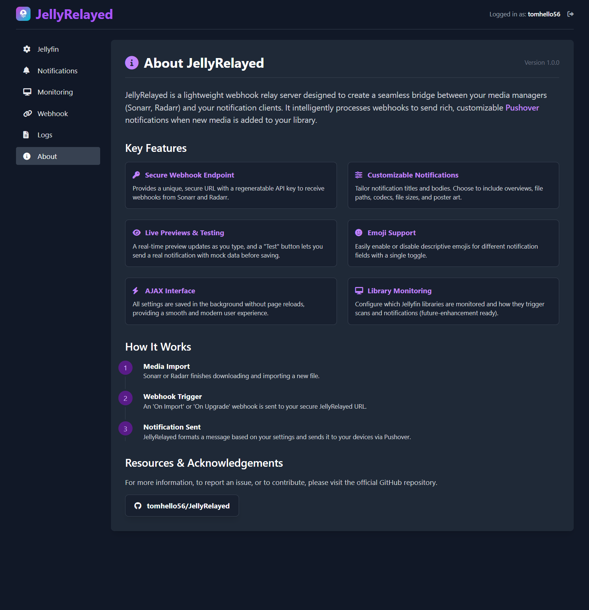
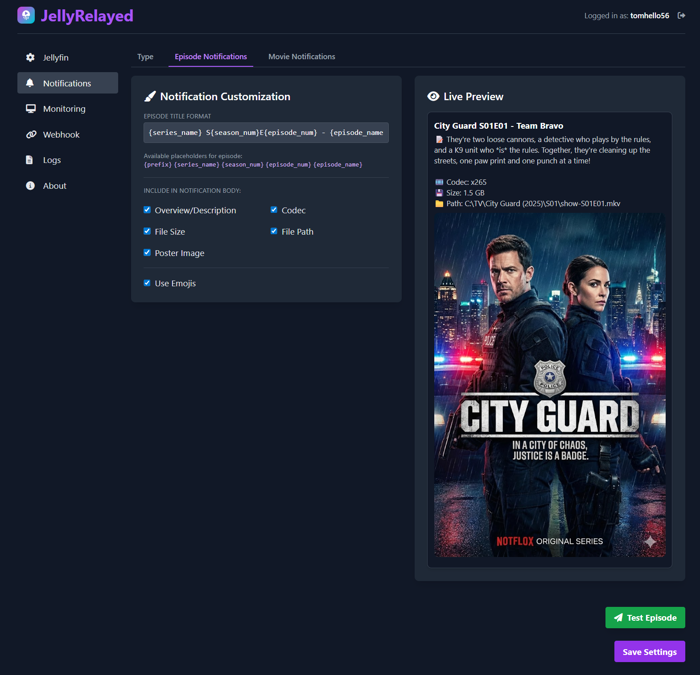
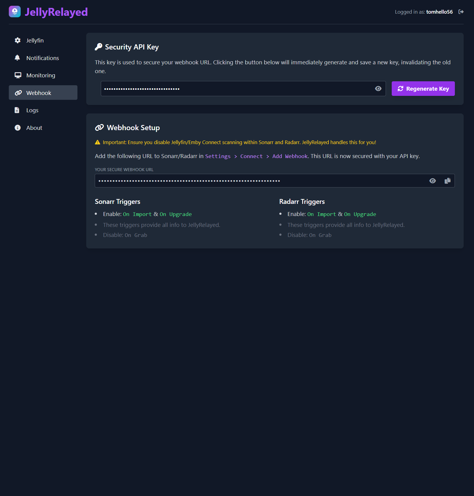
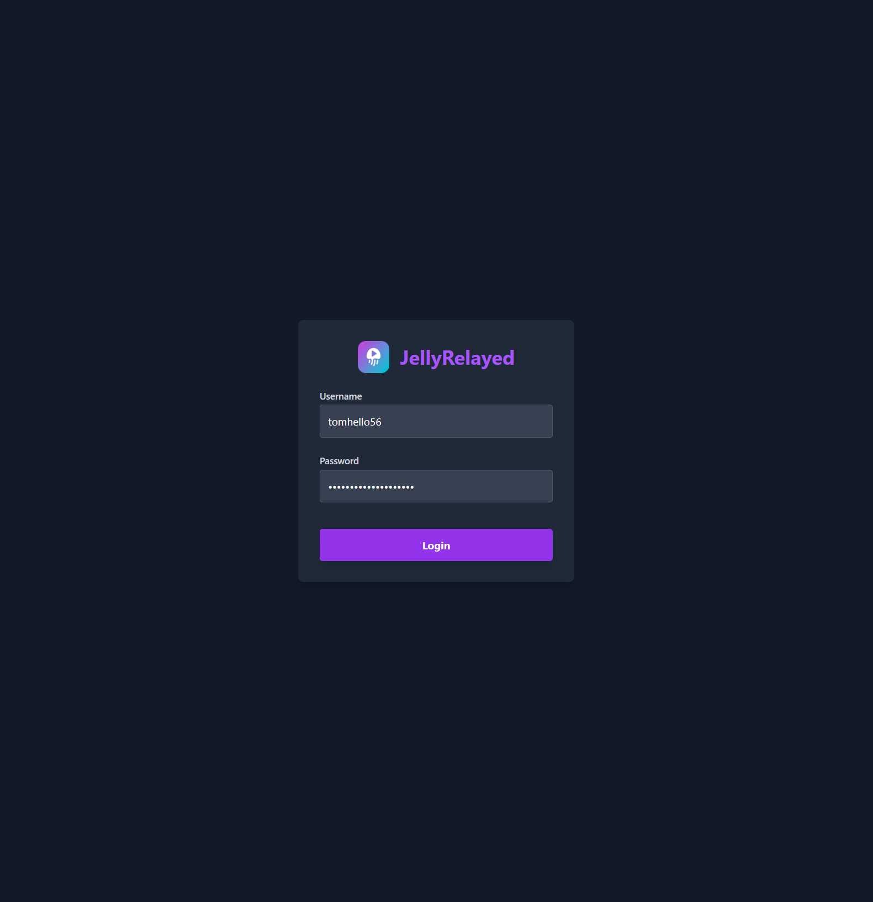

<div align="center">
  
  <h1>JellyRelayed</h1>
  <p><i>A smart webhook relay for Sonarr/Radarr to Pushover notifications.</i></p>  
  <p>
    <a href="https://opensource.org/licenses/MIT"></a>
    
    
    
  </p>
</div>

---

**JellyRelayed** is a lightweight webhook relay server designed to create a seamless bridge between your media managers (Sonarr, Radarr) and your notification clients. It intelligently processes webhooks to send rich, customizable **Pushover** notifications when new media is added to your library.

## 🖼️ Screenshots

<p align="center">
  
</p>
<p align="center">
  
  
</p>
<p align="center">
  
  
</p>

## ✨ Key Features

- **🚀 Secure Webhook Endpoint:** Provides a unique, secure URL with a regeneratable API key to receive webhooks from Sonarr and Radarr.
- **🎨 Customizable Notifications:** Tailor notification titles and bodies. Choose to include overviews, file paths, codecs, file sizes, and poster art.
- **👁️ Live Previews & Testing:** A real-time preview updates as you type, and a "Test" button lets you send a real notification with mock data before saving.
- **😃 Emoji Support:** Easily enable or disable descriptive emojis for different notification fields with a single toggle.
- **⚡ AJAX Interface:** All settings are saved in the background without page reloads, providing a smooth and modern user experience.
- **🖥️ Library Monitoring:** Configure which Jellyfin libraries are monitored and how they trigger scans and notifications.
- **🐳 Docker First:** Designed to be deployed quickly and easily as a Docker container.
- **🔐 Protected UI:** A simple login system prevents unauthorized access to your settings.

## ⚙️ How It Works

<div align="center">

| Step 1: Import | Step 2: Webhook | Step 3: Notify |
| :---: | :---: | :---: |
| `Sonarr/Radarr` imports a new file. | An `On Import` webhook is sent to your secure JellyRelayed URL. | `JellyRelayed` formats and sends a rich notification via `Pushover`. |

</div>

## 🚀 Getting Started

Deploying with Docker is the simplest and recommended method.

### Step 1: Prepare the Project

First, clone the repository to your machine:
```sh
git clone https://github.com/tomhello56/JellyRelayed.git
cd JellyRelayed
```

Next, create a `config` directory. This is where JellyRelayed will store its configuration file.
```sh
mkdir config
```

### Step 2: Configure Docker Compose

Copy the example compose file to a new file named `docker-compose.yml`:
```sh
cp docker-compose.example.yml docker-compose.yml
```
Now, open `docker-compose.yml` and edit the `volumes` section. This is the **most important step**. You must map the directories on your host machine to the paths inside the container so that JellyRelayed can understand the file paths sent by Sonarr/Radarr.

Here is the full `docker-compose.yml` for reference:

```yaml
# docker-compose.yml
version: "3.7"
services:
  jellyrelayed:
    # OPTION 1 (Default): Build from source. Recommended for most users.
    build: .

    # OPTION 2: Use a pre-built image from GitHub Container Registry.
    # To use this, comment out 'build: .' and uncomment 'image:'.
    # image: ghcr.io/tomhello56/jellyrelayed:latest

    restart: unless-stopped

    ports:
      - "5000:5000"

    volumes:
      # This volume is required for the configuration file.
      # The path on the left must be an absolute path to your created 'config' folder.
      - /path/to/your/config:/data
      
      # --- IMPORTANT MEDIA MAPPING ---
      # You must map your media library to the /media path inside the container.
      # The path on the left MUST match the root media path that Sonarr/Radarr use.

      # Example for Linux (Unraid, etc.):
      # If Sonarr sees your TV shows at '/mnt/user/media/tv', map the parent folder.
      - /path/to/your/media:/media

      # Example for Windows:
      # If Radarr sees your movies at 'D:\Media\Movies', map the 'D:\Media' folder.
      # - "D:/Media:/media"
```

> **Warning**
> The path you map to `/media` inside the container **must** be the parent folder of the paths Sonarr/Radarr report. For example, if Radarr's webhook sends a path of `/media/movies/My Movie (2023)/movie.mkv`, you must map your host's media directory (e.g., `/mnt/data`) to `/media` in the container.

### Step 3: Launch the Application

Run the following command to build and start the container in the background:
```sh
docker-compose up -d --build
```
The application will now be running on the port you specified (default: `5000`).

## 🛠️ Configuration

Once the container is running, all configuration is done through the web UI.

1.  **First-Time Setup:** Navigate to `http://<your-server-ip>:5000`. You will be prompted to create your admin username and password on your first visit.
2.  **Jellyfin Settings:** Go to the **Jellyfin** page and enter your server URL and an API Key.
3.  **Notification Settings:**
    - Go to the **Notifications** page.
    - On the **Type** tab, enter your Pushover Application Token and User Key.
    - On the **Episode** and **Movie** tabs, customize the notification content to your liking. Use the live preview to see your changes and the "Test" button to send a sample notification.
    - Click **Save Settings** when you are done.
4.  **Webhook URL:** Go to the **Webhook** page. You will find your unique, secure webhook URL here. Click the "Regenerate Key" button if you ever need to create a new one.

## 📡 Usage with Sonarr/Radarr

1.  On the JellyRelayed **Webhook** page, copy the "Your Secure Webhook URL".
2.  In Sonarr or Radarr, go to `Settings` > `Connect` and click the `+` button to add a new connection.
3.  Select **Webhook**.
4.  Give it a name (e.g., "JellyRelayed").
5.  Paste the URL into the **URL** field.
6.  Ensure the following triggers are enabled:
    - **On Import**
    - **On Upgrade**
7.  Save the connection.

That's it! The next time Sonarr or Radarr imports a file, JellyRelayed will send a notification.

## License

This project is licensed under the MIT License - see the [LICENSE](LICENSE) file for details.
